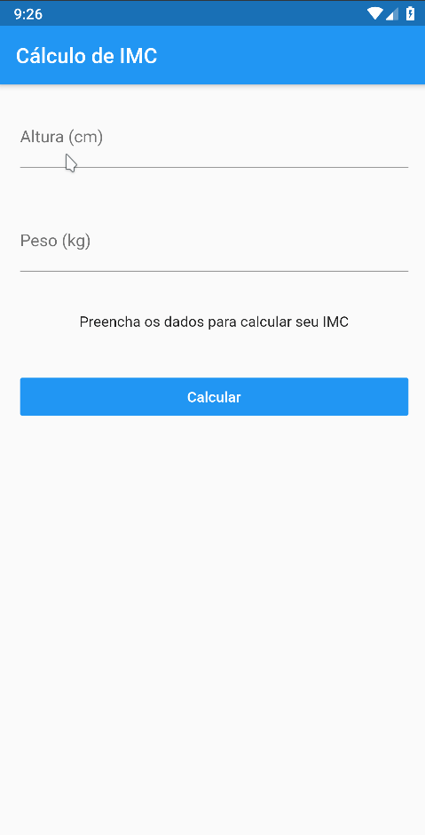
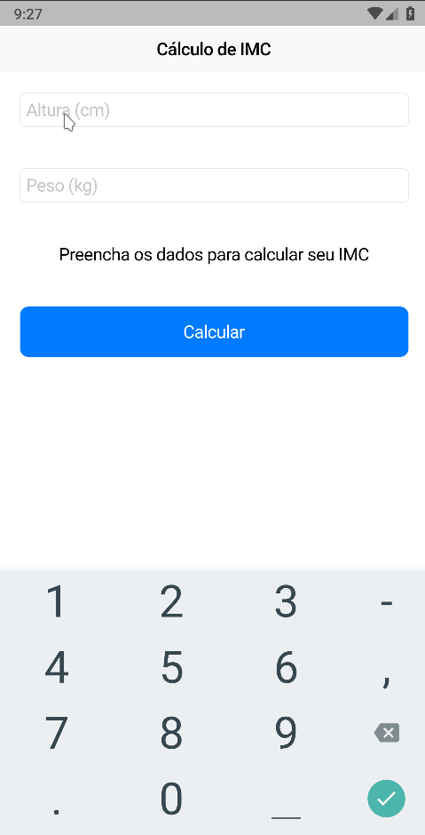

<div align="center" >
  
</div>
<h1 align="center" >
    IMC App
</h1>

<h4 align="center">
  Descubra o seu índice de massa corpórea e veja como anda seu peso!
</h4>
<div align="center" >
  

  
</div>

<p align="center">
  <a href="#large_blue_diamond-sobre">Sobre</a>&nbsp;&nbsp;&nbsp;|&nbsp;&nbsp;&nbsp;
  <a href="#large_blue_diamond-conteudo-estudado">Conteúdo estudado</a>&nbsp;&nbsp;&nbsp;|&nbsp;&nbsp;&nbsp;
  <a href="#large_blue_diamond-tecnologias">Tecnologias</a>&nbsp;&nbsp;&nbsp;|&nbsp;&nbsp;&nbsp;
  <a href="#large_blue_diamond-como-utilizar">Como instalar</a>
</p>
<br/>

## :large_blue_diamond: Sobre

Nesta simples aplicação, você pode descobrir o seu IMC (Índice de Massa Corpórea) e ter uma avaliação de como está o seu peso.

O objetivo deste app foi estudar a utilização de diferentes interfaces (Android e IOS) e escrever apenas uma vez a regra de negócio utilizando o padrão BLoC (Business Logic Object Component).

Este projeto foi desenvolvido no curso Flutter Apps: IMC com Material, Cupertino e BLoC, do [Balta.io](https://balta.io/).
<br/>
<br/>

## :large_blue_diamond: Conteudo estudado

Neste projeto de estudo foram vistos os seguintes conteúdos:

- Construção de layouts e interfaces com Material e Cupertino
- BLoC (Business Logic Object Component)
  <br/>
  <br/>

## :large_blue_diamond: Tecnologias

Este projeto foi desenvolvido com as seguintes tecnologias

- [Flutter](https://flutter.dev/)
- [Flutter Masked Text](https://pub.dev/packages/flutter_masked_text)
- [VS Code][vc]
  <br/>
  <br/>

## :large_blue_diamond: Como utilizar

Para rodar a aplicação você precisa ter o [Git](https://git-scm.com) e [Flutter](https://flutter.dev/) na sua máquina. Você precisará também de um emulador para Android ou IOS.
Como sugestão, utilize o emulador Android do [Android Studio](https://developer.android.com/studio) ou o [Genymotion](https://www.genymotion.com/).

Abra seu emulador e siga os comandos abaixo em seu terminal:

```bash
# Clone this repository
$ git clone https://github.com/agnaldoburgojr/imc-app.git imcApp

# Go into the repository
$ cd imcApp

# Run the app
$ flutter run
```

<br/>

## :large_blue_diamond: Licença

Este projeto possui Licença MIT. Olhe [LICENSE](https://github.com/agnaldoburgojr/imc-app/blob/master/LICENCE) para mais informações.

<br/>

---

Feito com ♥ por Agnaldo Burgo Junior :wave: [Get in touch!](https://www.linkedin.com/in/agnaldo-burgo-junior/)

[vc]: https://code.visualstudio.com/
